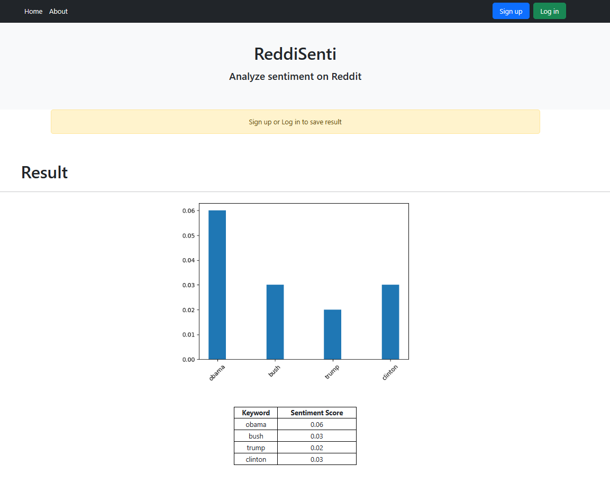

Note: This project uses an API key that is not included in the repository. If you want to use this project, please visit the website at [Reddi-Senti](https://reddi-senti.onrender.com/) instead of cloning the repository.

# Reddi-Senti    *Analyze sentiment on Reddit*
"Reddi-Senti" is a Flask web application that allows users to analyze the sentiment of keywords searched on Reddit, the popular social news aggregation and discussion website. With "Reddi-Senti," users can compare the sentiment of multiple keywords and view visualized graphs comparing the results of sentiment analysis for each keyword.
    

## Prerequisites
- Python 3.6 or later
- PostgreSQL

## Installing
1. Clone the repository to your local machine using the command  
    `git clone https://github.com/username/reddi-senti.git`
2. Navigate to the project directory.
3. Create a virtual environment using   
    `python3 -m venv venv`
4. Activate the virtual environment using  
    
    `source venv/bin/activate`
5. Install the required Python packages using  
    
    `pip3 install -r requirements.txt`
6. Create a PostgreSQL database for the project.  
   `createdb reddi-senti`
7. Create a .env file in the project root directory and set the DATABASE_URL and SECRET_KEY environment variables. For example:
makefile
Copy code
DATABASE_URL=postgresql:///reddi-senti# capstone_project_1
SECRET_KEY=mysecretkey
1. Run the migrations using flask db upgrade.
2. Start the Flask development server using flask run.

## Usage
Once you have the project up and running, you can navigate to http://localhost:5000/ to use the application. The homepage will show a form for analyzing the sentiment of comments on a subreddit of your choice. If you're not logged in, you can create a new account or log in with an existing one. After you log in, you can save your analysis cards and view them on your user dashboard.

Built with
- Flask - Python web framework
- Bootstrap - Front-end framework
- Chart.js - JavaScript charting library
- VADER - Python package for sentiment analysis

Authors
John Doe - Initial work - johndoe
